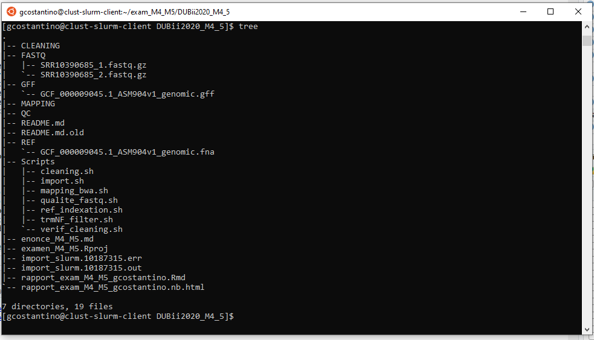
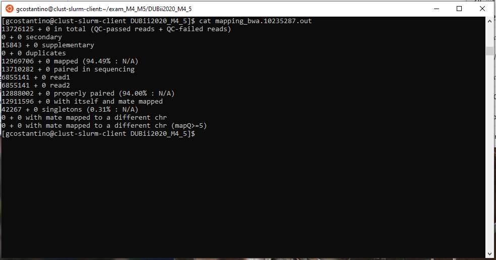
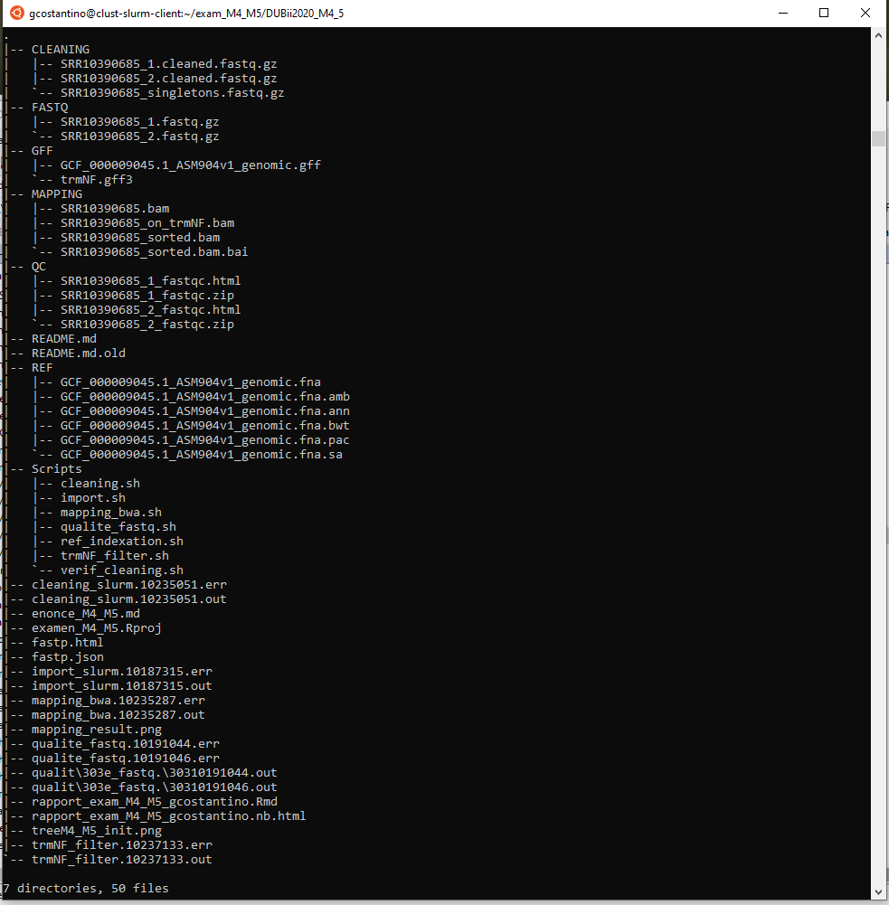

# Enoncé

Nous allons vous faire faire un analyse simple, de données de reséquençage d'un génome bactérien. Les données sont issues de cet article : "Complete Genome Sequences of 13 Bacillus subtilis Soil Isolates for Studying Secondary Metabolite Diversity" [doi:10.1128/MRA.01406-19](https://doi.org/10.1128/MRA.01406-19)  

Nous alons vous demander de faire une première analyse de ces données, et de nous la rendre sous la forme d'un rapport qui trace l'ensemble des étapes suivies. Ce rapport devra être mis à nôtre disposition dans un dépôt public GitHub. Les analyses devront pouvoir être rejouées sur le cluster de l'IFB.  

## Données d'entrées :

* Identifiant du run : **SRR10390685**   
* Génome de référence : **NC_000964**     
  * [Gff](https://ftp.ncbi.nlm.nih.gov/genomes/all/GCF/000/009/045/GCF_000009045.1_ASM904v1/GCF_000009045.1_ASM904v1_genomic.gff.gz)  
  * [Fasta](https://ftp.ncbi.nlm.nih.gov/genomes/all/GCF/000/009/045/GCF_000009045.1_ASM904v1/GCF_000009045.1_ASM904v1_genomic.fna.gz)    
        
## Consignes :

### Détailler les différentes étapes dans un rapport HTML ou PDF (généré via un Rmd ou autre).

#### Téléchargement des données depuis les banques publiques

Les fichiers fasta et gff de la séquence de référence **NC_000964** sont à récupérer à partir du site ftp de ncbi avec la commande linux wget.  
Les reads fastq de **SRR10390685** à mapper sur la référence sont téléchargés depuis la base de données SRA de ncbi avec la fonction fasterq-dump de sra-tools.  
L'espace de travail et l'import des données est réalisé à l'aide du script import.sh à partir du répertoire courant.  
[import.sh](https://github.com/gicostantino/gicostantino.github.io/blob/master/import.sh)  

```{bash import.sh, echo=TRUE, eval=FALSE}
#!/bin/bash
#SBATCH -o import_slurm.%j.out  #stdout
#SBATCH -e import_slurm.%j.err  #stderr
#SBATCH --cpus-per-task 8

#organisation espace de travail

mkdir GFF
mkdir REF
mkdir FASTQ
mkdir QC
mkdir CLEANING
mkdir MAPPING

#import des données
cd GFF
srun wget https://ftp.ncbi.nlm.nih.gov/genomes/all/GCF/000/009/045/GCF_000009045.1_ASM904v1/GCF_000009045.1_ASM904v1_genomic.gff.gz
srun gunzip GCF_000009045.1_ASM904v1_genomic.gff.gz

cd ../REF
srun wget https://ftp.ncbi.nlm.nih.gov/genomes/all/GCF/000/009/045/GCF_000009045.1_ASM904v1/GCF_000009045.1_ASM904v1_genomic.fna.gz
srun gunzip GCF_000009045.1_ASM904v1_genomic.fna.gz

cd ../FASTQ
module load sra-tools
srun --cpus-per-task 8 fasterq-dump -S -p SRR10390685 --outdir . --threads 8
srun --cpus-per-task 8 pigz -p8 SRR10390685_1.fastq
srun --cpus-per-task 8 pigz -p8 SRR10390685_2.fastq
```

La commande bash `tree` sur le cluster core.cluster.france-bioinformatique.fr montre le résultat suivant: 



#### Contrôle qualité des données brutes (reads) 

Les fichiers fastq du répertoire FASTQ/ sont visualisés avec la commande *fastqc* introduite dans le fichier bash **[qualite_fastq.sh](https://github.com/gicostantino/gicostantino.github.io/blob/master/qualite_fastq.sh)  ** .
Chaque fichier fastq est analysé en parallèle
Les rapports html des fichiers fastq analysés par fastqc sont dans le répertoire QC/  

```{bash qualite_fastq.sh,echo=TRUE,eval=FALSE}
#! /bin/bash
#SBATCH --array=0-1
#SBATCH -o qualite_fastq.%j.out
#SBATCH -e qualite_fastq.%j.err

module load fastqc

output_dir="QC"
FASTQ_FILES=(FASTQ/*.fastq.gz)

srun fastqc --quiet ${FASTQ_FILES[$SLURM_ARRAY_TASK_ID]} -o ${output_dir}
```

  * La qualité des bases vous paraît-elle satisfaisante ? Pourquoi ? 
 
Le rapport de SRR10390685_1.fastq.gz indique qu'il contient 7066055 reads de longueur entre 35 et 151 nt avec un %GC de 43% avec une sur-représentation de polyN.  Celui de SRR10390685_2.fastq.gz indique autant de reads, mais de longueur entre 130 et 151 nt avec le même taux de %GC avec une sur-représentation de polyG et en fin de séquence une proportion de reads ayant l'adaptateur universel d'illumina.
La partie "Per base sequence content" indique un drapeau rouge pour les 2 lots de reads, les dernières bases sont déséquilibrées en proportion. 

Il est préférable de nettoyer les fins des séquences et supprimer les séquences les plus courtes pour ne garder que les pairs de séquence les mieux  et de longueurs homogènes!! 
  
  * Quelle est la profondeur de séquençage (calculée par rapport à la taille du génome de référence) ?  
  
 7066055 reads x 150 nt x 2=2119816500 pb pour le Bacillus subtilis P5_B1.  
Le génome de référence fait 4215606 pb.
La profondeur de séquençage est de 2119816500 / 4215606 = **503x** 
  
#### Nettoyage des reads 

L'outil choisi pour nettoyer les reads est **fastp**.  
Cet outil est multi-threadable et simple à mettre en oeuvre pour les séquences en paired-ends. 
l'option `-l 100` va permettre de ne garder que les reads de taille supérieur à 100 nt et `-t 8` va trimmer les 8 dernières bases des reads de SRR10390685_1.fastq.gz.
Le fichier [cleaning.sh](https://github.com/gicostantino/gicostantino.github.io/blob/master/cleaning.sh) réalise ces taches sur 8 cpus pour gagner un peu de temps.
```{bash cleaning.sh, echo=TRUE}
#! /bin/bash
#SBATCH -o cleaning_slurm.%j.out
#SBATCH -e cleaning_slurm.%j.err
#SBATCH --cpus-per-task 8

module load fastp

srun --cpus-per-task 8 fastp --in1 FASTQ/SRR10390685_1.fastq.gz --in2 FASTQ/SRR10390685_2.fastq.gz -l 100 --out1 CLEANING/SRR10390685_1.cleaned.fastq.gz --out2 CLEANING/SRR10390685_2.cleaned.fastq.gz --unpaired1 CLEANING/SRR10390685_singletons.fastq.gz --unpaired2 CLEANING/SRR10390685_singletons.fastq.gz -w 1 -h fastp.html -t 8

```
  * Quel pourcentage de reads sont filtrés et pourquoi ? 
  
Le rapport fastp.html indique que initialement il y avait 14.132110 Millions de reads et après le nettoyage avec fastp et les paramètres utilisés il reste 13.710282 millions de reads pairés, soit environ **97%** des reads initiaux.  
Les reads exclus (**3%**) sont ceux de moindre qualités (2.52%), avec trop de N (0.03%) ou de longueur trop courte (0.44%). 
  
#### Alignement des reads sur le génome de reférence  

Le mappeur utilisé pour positionner sur la séquence de la référence les reads à analyser est **bwa**.
Dans un premier temps bwa indexe le fasta de la référence **GCF_000009045.1_ASM904v1_genomic.fna**, et ensuite il réalise le positionnement des reads pairés nettoyés sur la référence.  
Le fichier de sortie est le fichier **SRR10390685_sorted.bam** qui stocke de façon tabulée les positions des reads, qualité de positionnement...  
Le fichier [mapping_bwa.sh](https://github.com/gicostantino/gicostantino.github.io/blob/master/mapping_bwa.sh) réalise ces taches successivement.

```{bash mapping_bwa.sh}

#!/bin/bash
#SBATCH -o mapping_bwa.%j.out  #stdout
#SBATCH -e mapping_bwa.%j.err  #stderr
#SBATCH --cpus-per-task 4


module load bwa
module load samtools

srun bwa index REF/GCF_000009045.1_ASM904v1_genomic.fna

srun --cpus-per-task=4 bwa mem REF/GCF_000009045.1_ASM904v1_genomic.fna CLEANING/SRR10390685_1.cleaned.fastq.gz CLEANING/SRR10390685_2.cleaned.fastq.gz -t 3 | samtools view -hbS > MAPPING/SRR10390685.bam 
srun samtools flagstat MAPPING/SRR10390685.bam
srun samtools sort MAPPING/SRR10390685.bam -o MAPPING/SRR10390685_sorted.bam

```

  * Quel est le % de reads pairés alignés ? 

Le fichier de sortie du mapping *mapping_bwa.10235287.out* indique 12969706 reads mappés sur 13726125 reads totaux soit **94.49%** le taux de reads correctement mappés sur la référence.
aucune séquence ne mappe plusieurs scaffold.  
  

#### Extraire dans un fichier BAM les reads chevauchant à au moins 50% le gène trmNF  

Le script bash permettant de filtrer le gff de la référence pour ne garder que les positions du gène trmNF et de les croiser avec le fichier bam des reads mappant 50% de la référence est :  
**[trmNF_filter.sh](https://github.com/gicostantino/gicostantino.github.io/blob/master/trmNF_filter.sh)**  
```{bash trmNF_filter.sh}
#!/bin/bash
#SBATCH -o trmNF_filter.%j.out  #stdout
#SBATCH -e trmNF_filter.%j.err  #stderr

module load bedtools
module load samtools

#filtre des genes trmNF
srun grep trmNF GFF/GCF_000009045.1_ASM904v1_genomic.gff | awk '$3=="gene"' > GFF/trmNF.gff3

#bedtools intersect
srun samtools index MAPPING/SRR10390685_sorted.bam
srun bedtools intersect -a MAPPING/SRR10390685_sorted.bam -b GFF/trmNF.gff3 -f 0.5 > MAPPING/SRR10390685_on_trmNF.bam
srun samtools view -c MAPPING/SRR10390685_on_trmNF.bam

```
Le fichier **trmNF.gff3** indique que le gène trmNF existe dans le génome de référence circulaire de bacilus subtilis sur un locus entre les positions 42917 et 43660.
le fichier *trmNF_filter.10237133.out* indique que **2848 reads mappent sur au moins 50% du gène trmNF**. le contenu des ces reads est dans le fichier **MAPPING/SRR10390685_on_trmNF.bam**.

Finalement,L'espace de travail sur mon Home a l'arborescence suivante:
  
